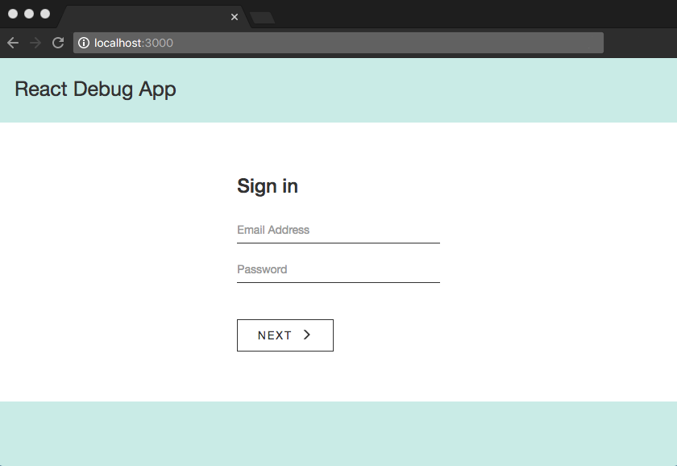

# React Debug Exercise

The code in this app is intentionally broken.

Debugging is not only a great way to learn but it's also a valuable skill. Developers are frequently tasked with debugging code, and it's common for developers to debug code that was written by another team member (either past or present).

This exercise was originally created to help co-workers learn React. It also serves a real-world example with common page elements (login form, navigation bar, etc.) and provides an alternative to the to-do app that's widely used to teach CRUD functionality in front end tutorials.

### Before You Start

You should be able to progress past the sign in form when the code is fixed. Any test login credentials will work (the app has no back end authentication or form validation beyond what's native to the browser). The main view looks like the screenshot below:

<p align='center'>
  
</p>

React is easier to debug when you have a solid foundation in [HTML](http://learn.shayhowe.com/html-css/getting-to-know-html/), [CSS](http://learn.shayhowe.com/html-css/getting-to-know-css/) and [JavaScript](https://developer.mozilla.org/en-US/docs/Learn/Getting_started_with_the_web/JavaScript_basics). JSX is also important to learn. [JSX](https://medium.com/javascript-scene/jsx-looks-like-an-abomination-1c1ec351a918#.ro3sx1ea0), an HTML/CSS/JavaScript purée, it not required in React applications but is considered an industry standard.

The SAR method (Situation, Action, Result) is a great method for thinking through the steps needed to solve a problem. For a written bug report, I use the SEA template (Steps to reproduce, Expected result, Actual result).

This app includes a lint tool, so many errors will display in the Terminal app (Mac) or Command Prompt (Windows). The JavaScript console in the developer tools menu of any modern browser should also provide assistance.

Traditional methods for [debugging Javascript](https://medium.com/@sandeep.scet/different-ways-to-debug-javascript-code-579e7f58cf10#.3gbqsze60) won't always work in a React application because React code isn't native to the browser. [React Dev Tools](https://github.com/facebook/react-devtools) might be more helpful. The component hierarchy is highly visible in React Dev Tools, which makes it easier to narrow in on the scope of a problem (and find where an element's nested in the actual code).

### Installation

1.  Check that Node and NPM are installed. Run `node -v` and then `npm -v` from the command line (Windows) or Terminal app (Mac). If a version number does not print to the console, follow [Mac](http://blog.teamtreehouse.com/install-node-js-npm-mac) or [Windows](http://blog.teamtreehouse.com/install-node-js-npm-windows) installation instructions.

2.  Clone the repository, install dependencies, then start the development server (from the command line or Terminal app):

  ```
    > git clone git@github.com:kristingreenslit/react-debug-exercise.git
    > cd react-debug-exercise
    > npm install
    > npm start
  ```

3.  Visit http://localhost:3000 to view the app in your browser of choice. Note: Running `npm start` and entering the keyboard shortcut `CTRL + C` from the project's root directory will start and stop the server.

### Debugging Tips for Teams

* Save the SEA template mentioned above (Steps to reproduce, Expected result, Actual result) as a signature in your email client (such as [Outlook](https://support.office.com/en-us/article/Create-and-add-a-signature-to-messages-8ee5d4f4-68fd-464a-a1c1-0e1c80bb27f2)) if you find yourself frequently reporting bugs.

* Slack integrates with [GitHub](https://get.slack.help/hc/en-us/articles/232289568-Use-GitHub-with-Slack), [GitLab](https://docs.gitlab.com/ee/user/project/integrations/slack.html) and even [Jenkins](https://github.com/jenkinsci/slack-plugin) to automatically notify channels about events such as commits, builds, pull requests and deployment statuses.

* JIRA can be configured to [automatically generate](https://confluence.atlassian.com/adminjiracloud/creating-issues-and-comments-from-email-779288896.html) issues, comments and help desk requests.

### Additional Notes

React, an incredibly powerful JavaScript library used for building [SPAs](https://en.wikipedia.org/wiki/Single-page_application) (Single Page Applications), is one big magic trick. It breaks the mold of how traditional websites operate by rendering components on the client side as needed vs. rendering content from a server. Like any new technology, SPAs have [pros and cons](https://neoteric.eu/single-page-application-vs-multiple-page-application), but they offer huge advantages in terms of speed, performance and the overall user experience. An example is selecting the "like" or "favorite" button in a social media application. The update is immediately viewable because the user does not have to wait for a server response or page refresh to occur.

React is the view layer in the traditional "MVC" architecture. The use of third-party libraries with React, such as [Redux](https://css-tricks.com/learning-react-router/) and [React-Router](https://css-tricks.com/learning-react-redux/), can enhance React code so that the flow of data is more accessible, organized and/or traceable. This can be helpful in large-scale applications when data, such as a user object, needs to be passed around the application and/or certain views need to be restricted by user type. A series of tangled callback functions could result if the data flow is not well-managed (for example). 

[Create React App](https://github.com/facebookincubator/create-react-app) was used to bootstrap this project.

### Further Reading:

* [React documentation](https://facebook.github.io/react/)
* [High Level Overview](http://blog.reverberate.org/2014/02/react-demystified.html) (the syntax in this article is outdated)
* [TL;DR](http://blog.andrewray.me/reactjs-for-stupid-people/) (excuse the title on this one)
* [Props vs. State](https://themeteorchef.com/tutorials/understanding-props-and-state-in-react)
* [Virtual DOM vs. DOM](http://reactkungfu.com/2015/10/the-difference-between-virtual-dom-and-dom/)


