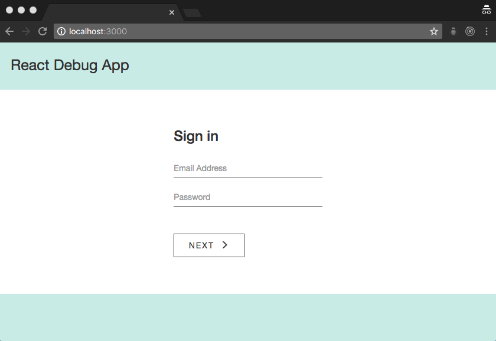

# React Debug Exercise

The code in this app is intentionally broken. In my own journey as a web developer, I've found that debugging is not only a valuable skill but also a great way to learn.

This app was created to help co-workers learn React. It provides an alternative to the traditional method of creating a todo app from scratch.

### Before You Start

You should be able to progress past the sign in form when the code is fixed. The app's main view looks like the screenshot below:

<p align='center'>
	
</p>


Traditional methods for [debugging Javascript](https://medium.com/@sandeep.scet/different-ways-to-debug-javascript-code-579e7f58cf10#.3gbqsze60) won't always work in a React application because React code isn't native to the browser. [React Dev Tools](https://github.com/facebook/react-devtools) might be more helpful. This app also includes a lint tool, so many errors will display in the Terminal app (Mac) or Command Prompt (Windows). The JavaScript console in the developer tools menu of any modern browser should also provide assistance.

The SAR method (Situation, Action, Result) is a great method for thinking through the steps needed to solve a problem. For a written bug report, I use the SEA template (Steps to reproduce, Expected result, Actual result). Pro tip: save the SEA template as a signature in your email client if you find yourself frequently reporting bugs. Also, JIRA can be configured to automatically generate bug tickets based on emails sent to a designated address.

### Installation

1.  Check that Node and NPM are installed. Run `node -v` and then `npm -v` from the command line (Windows) or Terminal app (Mac). If a version number does not print to the console, follow [Mac] (http://blog.teamtreehouse.com/install-node-js-npm-mac) or [Windows] (http://blog.teamtreehouse.com/install-node-js-npm-windows) installation instructions.

2.  Clone the repository, install dependencies, then start the development server (from the command line or Terminal app):

  ```
    > git clone git@github.com:kristingreenslit/react-debug-exercise.git
    > cd react-debug-exercise
    > npm install
    > npm start
  ```

3.  Visit http://localhost:3000 to view the app in your browser of choice. Note: Running `npm start` and entering the keyboard shortcut `CTRL + C` from the project's root directory will start and stop the server.

### Additional Notes

React is an incredibly powerful JavaScript library, but it's easier to learn when you have a solid foundation in [HTML](http://learn.shayhowe.com/html-css/getting-to-know-html/), [CSS](http://learn.shayhowe.com/html-css/getting-to-know-css/) and [JavaScript](https://developer.mozilla.org/en-US/docs/Learn/Getting_started_with_the_web/JavaScript_basics). An HTML/CSS/JavaScript purée, [JSX](https://medium.com/javascript-scene/jsx-looks-like-an-abomination-1c1ec351a918#.ro3sx1ea0), is an industry standard in React applications (although it is not required).

[Redux](https://css-tricks.com/learning-react-router/) and [React-Router](https://css-tricks.com/learning-react-redux/) are frequently used in React applications. The simple explanation is that React, a technology used for building Single Page Applications (SPAs), is one big magic trick. It breaks the mold of how traditional websites are expected to operate. However, React is the view layer in the traditional "MVC" architecture. The use of additional libraries with React, such as Redux and React-Router, can enhance React code so that the flow of data throughout an application is more accessible, organized and/or traceable.

[Create React App](https://github.com/facebookincubator/create-react-app) was used to bootstrap this project.

### Further Reading:

* [React documentation](https://facebook.github.io/react/)
* [High Level Overview](http://blog.reverberate.org/2014/02/react-demystified.html) (the syntax in this article is outdated)
* [TL;DR](http://blog.andrewray.me/reactjs-for-stupid-people/) (excuse the title on this one)
* [Props vs. State](https://themeteorchef.com/tutorials/understanding-props-and-state-in-react)
* [Virtual DOM vs. DOM](http://reactkungfu.com/2015/10/the-difference-between-virtual-dom-and-dom/)


